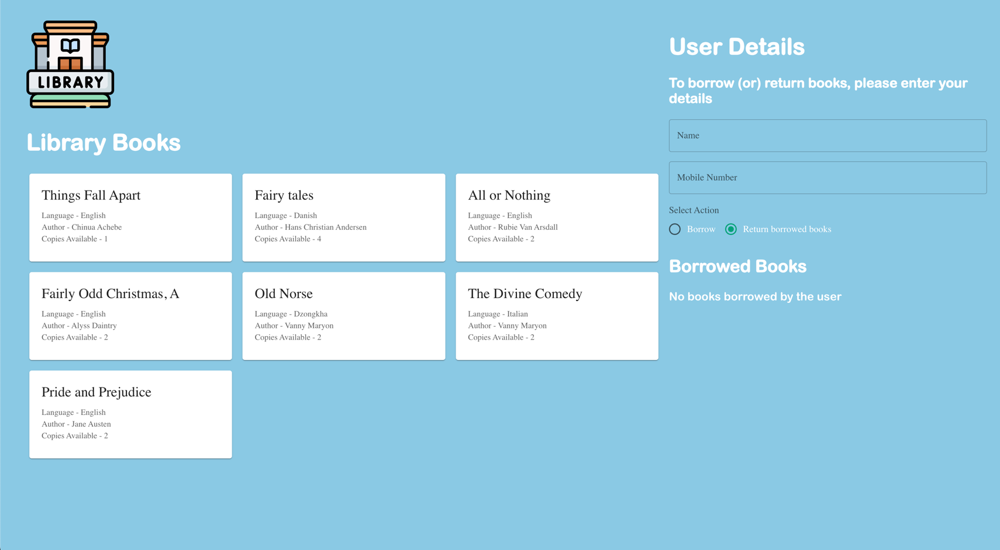
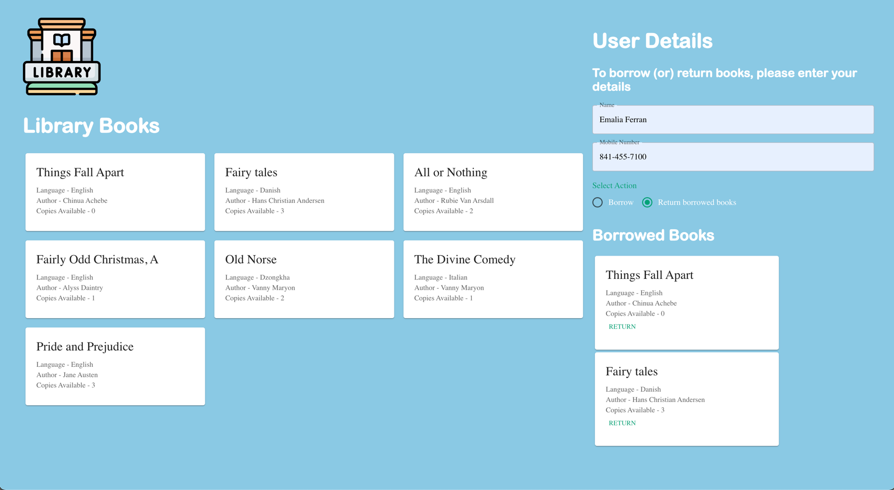

 
**Tech Stack : React**
 

**In Scope:**
1. Due to time constraints, I have added the logic in such a way that on load few books along with few users will be added to the library and for this mvp, the below are the limitations
2. The user can be only be one of the existing users added in [Users.json](./main/resources/Users.json). Hence to test the APIs, please use the users in [Users.json](./main/resources/Users.json) 
3. The books can be only be one of the existing books added in [Books.json](./main/resources/Books.json). Hence to test the APIs, please use the books in [Books.json](./main/resources/Books.json)
4. The User is expected to enter, the username and phoneNumber to proceed with either borrowing or returning books.
5. The books are displayed in the library and the user can borrow the book by clicking on the borrow button.
6. The user can return the book by clicking on the return button.
7. The user can borrow a maximum of 2 books at any point of time.
8. The user can borrow only 1 copy of a book at any point of time.
9. The user can return the book to the library.

**Out of Scope:**
1. UI tests
2. Creation of user and books, adding books to library
3. Validations
4. Exception handling